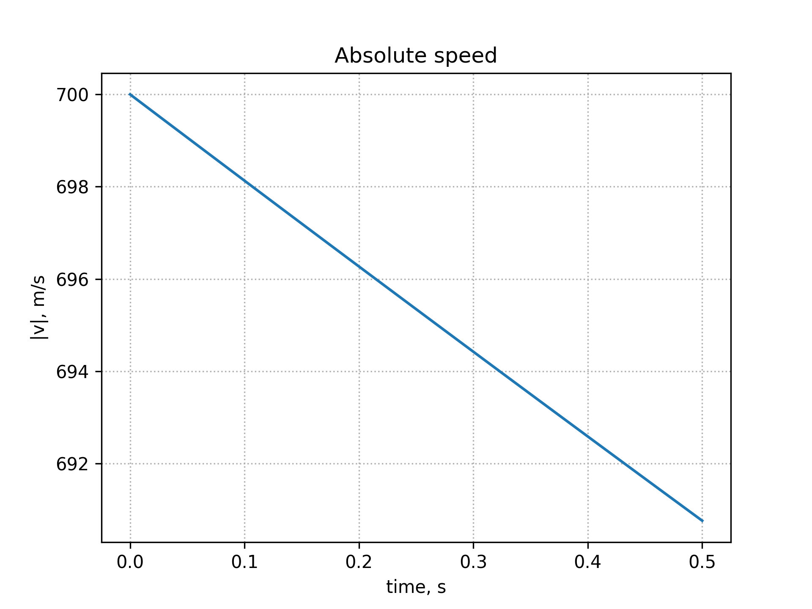

# ballistic-motion

This is a Python program to solve an ODE describing a projectile motion in
fields of gravity and air resistance. It applies only near Earth's surface at
altitudes less than 10 km, distances less than 100 km and speeds much less than
the speed of light.

## Description

Write Newton's second law:

$$
\sum_{i} \overrightarrow{F_i} = \frac{d \overrightarrow{p}}{dt} \quad (1),
$$

where:
- $\overrightarrow{F_i}$ - sum of forces acting on a body;
- $\overrightarrow{p}$ - momentum of a body.

In this problem sum of forces is combined from the force of gravity
($\overrightarrow{F_g}$) and air resistance
([drag](https://en.wikipedia.org/wiki/Drag_(physics))) ($\overrightarrow{F_d}$),
so to the left we have:

$$
\sum_{i} \overrightarrow{F_i} = \overrightarrow{F_g} + \overrightarrow{F_d}.
$$

Rewrite right part assuming constant mass $m$:

$$
\frac{d \overrightarrow{p}}{dt} = \frac{d (m \overrightarrow{v})}{dt} 
= m \frac{\overrightarrow{v}}{dt},
$$

where $\overrightarrow{v}$ - speed of the body.

Forces are defined as followes:

$$
\overrightarrow{F_g} = m \overrightarrow{g},
$$

$$
\overrightarrow{F_d} = -\frac{1}{2} C_d \rho A \overrightarrow{v^2} = k \overrightarrow{v^2},
$$

where:
- $C_d$ -  [drag coefficient](https://en.wikipedia.org/wiki/Drag_coefficient), constant;
- $\rho$ - air density , constant;
- $A$ - cross sectional area of the body;
- $\overrightarrow{v}$ - speed of the body;
- $k = -\frac{1}{2} C_d \rho A$.

Substitute forces to (1) and divide both sides by $m$:

$$
\frac{d \overrightarrow{v}}{dt} 
= \frac{1}{m} \left(\overrightarrow{F_g} + \overrightarrow{F_d} \right)
= \frac{1}{m} \left(m \overrightarrow{g} + k \overrightarrow{v^2} \right)
$$

Add to the system definition of speed $\overrightarrow{v}$ as the first
derivative of displacement $\overrightarrow{s}$:

$$
\left\\{ \begin{array}{l}
\frac{d \overrightarrow{s}}{dt} & = & \overrightarrow{s} \\
\frac{d \overrightarrow{v}}{dt} & = & \overrightarrow{g} + \frac{k}{m} \overrightarrow{v^2}
\end{array} \right.
$$

Find projections on the axis (gravity acts only along Oy):

$$
\left\\{ \begin{array}{l}
\frac{d x}{dt}   & = & v_x \\
\frac{d y}{dt}   & = & v_y \\
\frac{d v_x}{dt} & = & \frac{k}{m} v_x^2 \\
\frac{d v_x}{dt} & = & -g + \frac{k}{m} v_y^2
\end{array} \right.
$$

When given initial values for $x$, $y$, $v_x$, $v_y$ we have initial value
problem that can be easily integrated using various numerc
[algorithms](https://docs.scipy.org/doc/scipy/reference/generated/scipy.integrate.solve_ivp.html).

## Examples

### CD = 0, t_max = 1.45, v_0 = 10, angle = 45 degrees

[Theoretical
values](https://en.wikipedia.org/wiki/Projectile_motion#Displacement) without
drag force:

- time of flight = $\frac{2 v_0 \sin \theta}{g} \approx  \frac{2 \cdot 10 \cdot 0.707}{9.8} = 1.44$ s;
- distance at 1.44 s = $\frac{v_0^2}{g} \sin \left( 2 \theta \right) \approx \frac{10^2}{9.8} \cdot 1 = 10.2$ m;
- maximum height = $\frac{v_0^2 \sin^2 \theta}{2g} \approx 2.55$ m.

### CD = 0.1, t_max = 0.5, v_0 = 700, angle = 0

